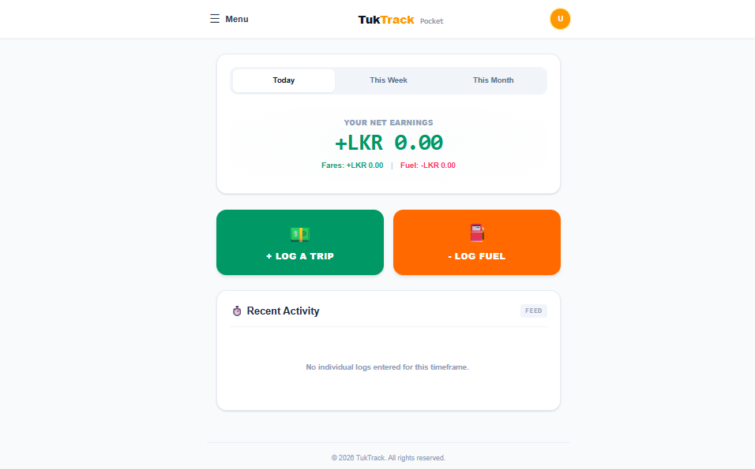
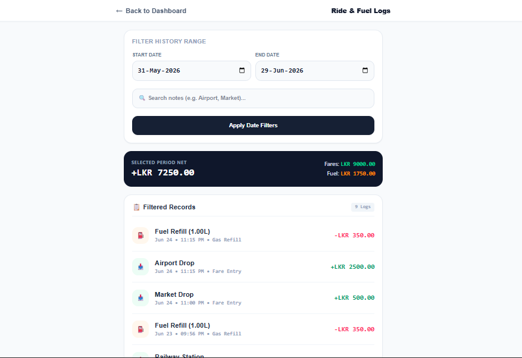

# Project

TukTrack - Know Your Profit
This is the documentation for TukTrack, a finance management application tailored for tuk-tuk drivers to accurately track their earnings and fuel expenses.

## Overview

Tuk-tuk drivers typically track their daily profits using paper notebooks or pure intuition, often leading to inaccurate insights regarding their actual take-home income. TukTrack addresses this by offering a lightweight, mobile-responsive web platform to log daily fares and fuel fill-ups, providing instant visibility into daily, weekly, and monthly net profitability.

The application features a Django backend with a REST API layer, secured by Supabase JWT Authentication, and supports offline data syncing capabilities.

Live application: https://tukprofit.up.railway.app

## Features

- Trip Logging: Quick entry system for passenger trip fares and custom notes.
- Fuel Tracking: Cost and liter logging for individual fuel fill-ups.
- Aggregated Dashboard: At-a-glance real-time summary of total fares, total fuel expenses, and absolute net earnings filtered by Day, Week, and Month.
- Offline Sync Engine: Client-side queue syncing mechanism that allows bulk creation of trips and fuel records once network connectivity is restored.
- Supabase Authentication: Secure, token-based authentication workflow integrated directly into Django REST Framework viewsets.

## Getting Started

1. Clone the repository.

- git clone https://github.com/yourusername/tuktrack.git
- cd tuktrack

2. Install dependencies.
Ensure you have Python installed, then set up your virtual environment and install the required modules:

- python -m venv venv
- source venv/bin/activate  # On Windows use `venv\Scripts\activate`
- pip install -r requirements.txt

3. Set Environment Variables
Create a .env file in your root directory and supply your Supabase credentials:

- SUPABASE_URL=your_supabase_project_url
- SUPABASE_ANON_KEY=your_supabase_anon_public_key
- SECRET_KEY=your_django_secret_key
- DEBUG=True

4. Run database migrations

- python manage.py migrate

5. Run the application

- python manage.py runserver

Access the local site at http://127.0.0.1:8000/

## Usage

User Routing & Interfaces
- / or /home/: Landing/marketing page detailing value propositions for drivers.

- /login/: Form to authenticate drivers using Supabase credentials.

- /dashboard/: Interactive interface summarizing net profits (today, this week, this month).

- /history/: Complete chronological list of logged logs (trips and fuel costs combined).

## API Endpoints

- GET /api/trips/ & POST /api/trips/: Retrieve or log trip entries.

- GET /api/fuel/ & POST /api/fuel/: Retrieve or log fuel cost receipts.

- GET /api/dashboard-summary/: Compiles aggregated financial values alongside formatted timelines for dashboard ingestion.

- POST /api/sync-offline/: Accepts a JSON list string sync_queue containing offline-cached records for atomic transactional backend integration.

## License

This project is provided for demonstration and production purposes. All rights reserved by TukTrack.

Screenshots:

